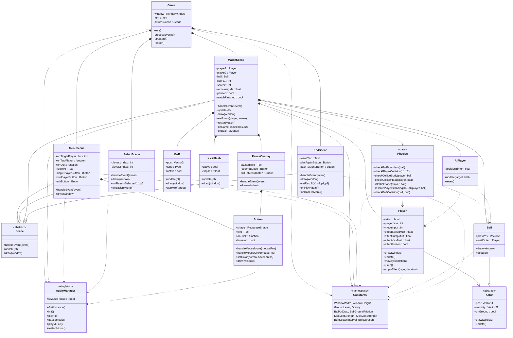

# SoccerFinal 类图

```mermaid
classDiagram
    %% ===== 继承关系 =====
    MenuScene    --|> Scene
    SelectScene  --|> Scene
    MatchScene   --|> Scene
    EndScene     --|> Scene
    Player       --|> Actor
    Ball         --|> Actor

    %% ===== 组合关系 =====
    Game          *-- MenuScene
    Game          *-- SelectScene
    Game          *-- MatchScene
    Game          *-- EndScene
    MenuScene     *-- Button
    MatchScene    *-- Player
    MatchScene    *-- Ball
    MatchScene    *-- AIPlayer
    MatchScene    *-- PauseOverlay
    MatchScene    *-- Buff
    MatchScene    *-- KickFlash
    PauseOverlay  *-- Button

    %% ===== 依赖关系 =====
    Game          ..> AudioManager
    Game          ..> Constants
    MatchScene    ..> Physics
    MatchScene    ..> AudioManager
    MatchScene    ..> Constants
    MenuScene     ..> AudioManager
    MenuScene     ..> Constants
    SelectScene   ..> AudioManager
    SelectScene   ..> Constants
    Button        ..> AudioManager
    Physics       ..> Player
    Physics       ..> Ball
    Physics       ..> Constants
    AIPlayer      ..> Player
    AIPlayer      ..> Ball
    Player        ..> Constants
    Ball          ..> Constants
    EndScene      ..> Constants

    %% ===== 类定义 =====
    class Scene {
        <<abstract>>
        +handleEvent(event)
        +update(dt)
        +draw(window)
    }

    class Actor {
        <<abstract>>
        +draw(window)
        +update()
        +pos : Vector2f
        +velocity : Vector2f
        +onGround : bool
    }

    class Game {
        +run()
        -processEvents()
        -update(dt)
        -render()
        -window : RenderWindow
        -font : Font
        -currentScene : Scene*
    }

    class MenuScene {
        +handleEvent(event)
        +draw(window)
        +onSinglePlayer : function
        +onTwoPlayer : function
        +onQuit : function
        -titleText : Text
        -singlePlayerButton : Button
        -twoPlayerButton : Button
        -exitButton : Button
    }

    class SelectScene {
        +handleEvent(event)
        +draw(window)
        +onPlayersSelected(p1,p2)
        +onBackToMenu()
        -player1Index : int
        -player2Index : int
    }

    class MatchScene {
        +handleEvent(event)
        +update(dt)
        +draw(window)
        +setArrow(player, arrow)
        +restartMatch()
        +onGameFinished(s1,s2)
        +onBackToMenu()
        -player1 : Player
        -player2 : Player
        -ball : Ball
        -score1 : int
        -score2 : int
        -remainingMs : float
        -paused : bool
        -matchFinished : bool
    }

    class EndScene {
        +handleEvent(event)
        +draw(window)
        +setResult(s1,s2,p1,p2)
        +onPlayAgain()
        +onBackToMenu()
        -resultText : Text
        -playAgainButton : Button
        -backToMenuButton : Button
    }

    class Player {
        +draw(window)
        +update()
        +move(orientation)
        +jump()
        +applyEffect(type, duration)
        +iskick : bool
        +playerface : int
        +moveInput : int
        +effectSpeedMult : float
        +effectJumpMult : float
        +effectKickMult : float
        +effectFrozen : bool
    }

    class Ball {
        +draw(window)
        +update()
        +prevPos : Vector2f
        +lastKicker : Player*
    }

    class Button {
        +shape : RectangleShape
        +text : Text
        +onClick : function
        +hovered : bool
        +handleMouseMove(mousePos)
        +handleMouseClick(mousePos)
        +setColor(normal,hover,press)
        +draw(window)
    }

    class PauseOverlay {
        +handleEvent(event)
        +draw(window)
        -pausedText : Text
        -resumeButton : Button
        -quitToMenuButton : Button
    }

    class AIPlayer {
        +update(target, ball)
        +reset()
        -decisionTimer : float
    }

    class Buff {
        +update(dt)
        +draw(window)
        +applyTo(target)
        +pos : Vector2f
        +type : Type
        +active : bool
    }

    class KickFlash {
        +update(dt)
        +draw(window)
        +active : bool
        -elapsed : float
    }

    class Physics {
        <<static>>
        +checkBallBoundary(ball)
        +checkPlayerCollision(p1,p2)
        +checkCollideBody(player, ball)
        +checkCollideHead(player, ball)
        +isInKickZone(player, ball)
        +resolvePlayerStandingOnBall(player, ball)
        +checkBuffCollision(ball, buff)
    }

    class AudioManager {
        <<singleton>>
        +GetInstance()
        +init()
        +play(id)
        +pauseMusic()
        +playMusic()
        +restartMusic()
        +isMusicPaused : bool
    }

    class Constants {
        <<namespace>>
        WindowWidth, WindowHeight
        GroundLevel, Gravity
        BallAirDrag, BallGroundFriction
        KickMinStrength, KickMaxStrength
        BuffSpawnInterval, BuffDuration
    }
```
